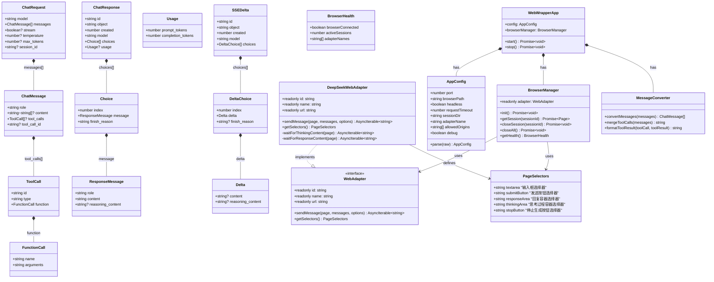
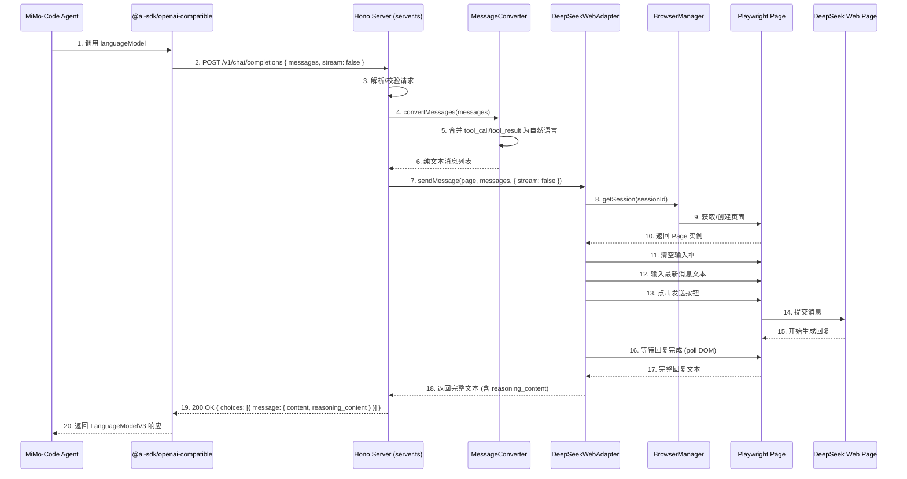
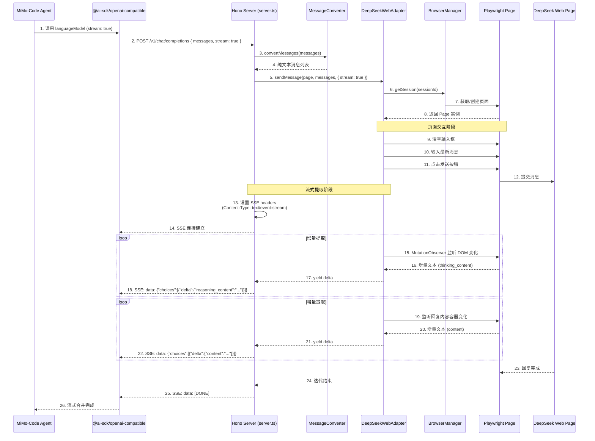
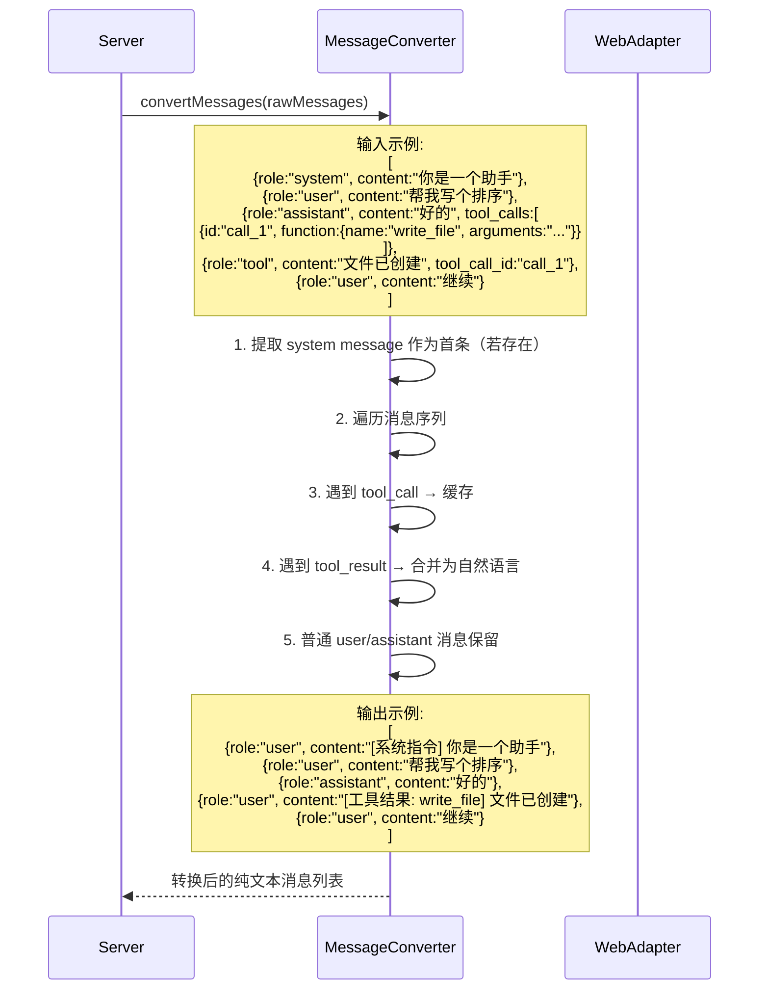
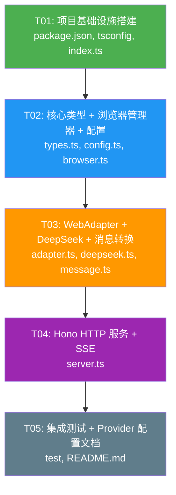

# Web Wrapper — 系统架构设计 & 任务分解

> **架构师**: Bob (高见远)  
> **日期**: 2025-06-30  
> **项目**: OpenCode v0.1.4 — `packages/web-wrapper/`

---

## Part A: 系统设计

---

### 1. 实现方案与框架选型

#### 1.1 核心挑战

| 挑战 | 说明 | 应对策略 |
|------|------|---------|
| **网页 DOM 不稳定** | AI 聊天网页（DeepSeek Web 等）的 DOM 结构可能随时更新，CSS 选择器失效 | WebAdapter 接口隔离 + 选择器集中管理 + 重试/降级策略 |
| **流式输出提取** | 网页侧无原生 SSE 事件，需通过 DOM 轮询或 MutationObserver 获取增量文本 | MutationObserver 监听回复容器 + 文本 diff 提取增量 |
| **会话持久化** | 网页登录 session 需要持久化，避免每次重启都重新登录 | Playwright 的 `storageState` + cookie 持久化到本地文件 |
| **消息格式转换** | Agent 传递的 tool_call/tool_result 需要转为网页模型能理解的自然语言 | 统一的消息合并策略，结构化的模板化拼接 |
| **并发请求处理** | 多个请求可能竞争同一页面状态 | 每个对话 session 使用独立 Page，通过 session ID 映射 |

#### 1.2 框架与库选型

| 组件 | 选择 | 理由 |
|------|------|------|
| **HTTP 框架** | `hono@4.10.7` | **已在 monorepo catalog 中**，轻量、TypeScript 优先、支持 SSE 流式输出 |
| **浏览器自动化** | `playwright@1.59.1` (chromium) | **已在 monorepo catalog 中**（`@playwright/test`），功能全面，稳定可靠 |
| **类型校验** | `zod@4.1.8` | **已在 catalog 中**，用于请求/响应/配置的运行时校验 |
| **运行时** | bun | 项目使用 bun 包管理器，`bun:test` 内置测试运行器 |

> **现状确认**: `hono` v4.10.7、`@playwright/test` v1.59.1、`zod` v4.1.8 均已在 monorepo 根目录 `package.json` 的 `workspaces.catalog` 中声明，web-wrapper 可直接通过 `"catalog:"` 协议引用。

#### 1.3 架构策略

**独立进程 HTTP 服务**：Web Wrapper 作为独立进程运行（类似一个本地代理服务），MiMo-Code（opencode）通过 HTTP 调用它，通过 `@ai-sdk/openai-compatible` 注册为标准 provider。

**架构层次**：
```
┌─────────────────────────────────────────────────────────────┐
│  HTTP Layer (Hono)                                          │
│  POST /v1/chat/completions   GET /health                    │
│  流式 SSE ──── 非流式 JSON                                   │
├─────────────────────────────────────────────────────────────┤
│  Request Processor Layer                                    │
│  消息格式转换 (tool_call/tool_result → 自然语言)              │
│  SSE 流式增量推送                                             │
├─────────────────────────────────────────────────────────────┤
│  WebAdapter Interface Layer                                 │
│  sendMessage(page, messages) → AsyncIterable<string>        │
│  ┌──────────────────────────────────────────────────────┐   │
│  │ DeepSeekWebAdapter (首个实现)                         │   │
│  │ · 发送消息到聊天输入框 → 点击发送                       │   │
│  │ · MutationObserver 监听回复容器提取增量                 │   │
│  │ · 思考过程提取 (reasoning_content)                     │   │
│  └──────────────────────────────────────────────────────┘   │
├─────────────────────────────────────────────────────────────┤
│  Browser Manager Layer                                      │
│  Playwright 浏览器实例生命周期管理                            │
│  Cookie/Session 持久化                                      │
│  Page 池管理 (按 session 隔离)                               │
└─────────────────────────────────────────────────────────────┘
```

**Provider 集成方案**（**无需修改 MiMo-Code 代码**）：
用户只需在 `mimocode.json` 中添加 provider 配置，指向 web-wrapper 的 baseURL：
```json
{
  "provider": {
    "web-wrapper": {
      "name": "Web Wrapper",
      "options": { "baseURL": "http://localhost:3456/v1" },
      "models": {
        "deepseek-web": {
          "name": "DeepSeek Web (Free)",
          "reasoning": true,
          "tool_call": false,
          "limit": { "context": 128000, "output": 8192 },
          "cost": { "input": 0, "output": 0 }
        }
      }
    }
  }
}
```

---

### 2. 文件列表

```
packages/web-wrapper/
├── package.json                          # 包声明 + 依赖 (hono, playwright, zod)
├── tsconfig.json                         # TypeScript 配置 (继承 @tsconfig/bun)
├── README.md                             # 使用说明
│
├── src/
│   ├── index.ts                          # 入口: 启动 Hono 服务 + 初始化浏览器
│   ├── config.ts                         # 配置: 端口/浏览器路径/超时/适配器选择
│   ├── types.ts                          # 类型: OpenAI 兼容请求/响应/SSE 事件类型
│   ├── message.ts                        # 消息转换: tool_call/tool_result → 自然语言
│   ├── server.ts                         # Hono 路由: /v1/chat/completions + /health
│   ├── browser.ts                        # Playwright 浏览器管理器 (生命周期/session)
│   ├── adapter.ts                        # WebAdapter 抽象接口定义
│   └── adapters/
│       └── deepseek.ts                   # DeepSeek Web 适配器 (选择器/页面交互/流式提取)
```

---

### 3. 数据结构和接口 (Class Diagram)



---

### 4. 程序调用流程 (Sequence Diagrams)

#### 4.1 非流式请求流程 (Non-streaming)



#### 4.2 流式 SSE 请求流程 (Streaming)



#### 4.3 消息格式转换流程 (Message Conversion)



---

### 5. 待明确事项

| ID | 问题 | 我的建议/决策 |
|----|------|-------------|
| Q-01 | **DeepSeek Web 登录流程** — 是否需要登录？ | **需要用户手动登录一次**。启动 web-wrapper 后，用户打开浏览器访问配置页面，手动登录 DeepSeek，session 自动持久化。后续重启自动复用。 |
| Q-02 | **DeepSeek Web 页面选择器稳定性** — 需要具体的 CSS 选择器 | 需根据 DeepSeek Web 当前版本实测确定。适配器将选择器集中在 `getSelectors()`，后续 DOM 变化只需修改此处。 |
| Q-03 | **System message 处理** — 网页模型不支持 system role | 将 system message 转为第一条 user message，前缀注明 `[系统指令]`。 |
| Q-04 | **多会话隔离策略** — 同浏览器不同 Page 还是不同浏览器上下文？ | 同一个 BrowserContext 的不同 Page。Page 之间完全隔离（cookie/localStorage 共享但是页面状态独立）。 |
| Q-05 | **安装方式** — 用户如何安装 Chromium？ | 在 `postinstall` script 中运行 `npx playwright install chromium`，或提示用户手动安装。 |
| Q-06 | **API 认证** — Web Wrapper 是否需要保护？ | P0 暂不需要。P1 阶段可增加简单的 Bearer token 认证。 |

---

## Part B: 任务分解

---

### 6. 所需依赖包

```json
{
  "dependencies": {
    "hono": "catalog:",
    "zod": "catalog:",
    "@playwright/test": "catalog:"
  },
  "devDependencies": {
    "@types/bun": "catalog:",
    "@tsconfig/bun": "catalog:",
    "typescript": "catalog:"
  }
}
```

> 所有依赖均已在 monorepo 根目录的 `workspaces.catalog` 中声明，通过 `"catalog:"` 协议引用即可。无需额外安装新包。

---

### 7. 任务列表 (按依赖顺序)

| 任务 | 名称 | 源文件 | 依赖 | 优先级 |
|------|------|--------|------|--------|
| **T01** | **项目基础设施搭建** | `package.json`, `tsconfig.json`, `src/index.ts` | 无 | **P0** |
| **T02** | **核心类型 + 浏览器管理器 + 配置系统** | `src/types.ts`, `src/config.ts`, `src/browser.ts` | T01 | **P0** |
| **T03** | **WebAdapter 接口 + DeepSeek 适配器 + 消息转换** | `src/adapter.ts`, `src/adapters/deepseek.ts`, `src/message.ts` | T02 | **P0** |
| **T04** | **Hono HTTP 服务 + API 端点 + SSE 流式输出** | `src/server.ts` | T03 | **P0** |
| **T05** | **集成测试 + Provider 配置文档** | `test/integration.test.ts`, `README.md` | T04 | **P1** |

#### T01: 项目基础设施搭建

- **文件**:
  - `packages/web-wrapper/package.json` — 包声明、依赖引用 (hono, playwright, zod 使用 catalog:)、scripts
  - `packages/web-wrapper/tsconfig.json` — TypeScript 配置，继承 `@tsconfig/bun`，生成 `dist/`
  - `packages/web-wrapper/src/index.ts` — 入口文件，解析命令行参数 → 加载配置 → 创建 BrowserManager → 启动 Hono 服务
- **依赖**: 无（根 monorepo 已有 bunfig.toml + workspaces 配置）
- **优先级**: P0
- **验收标准**:
  - `bun install` 成功安装依赖
  - `bun run src/index.ts` 启动后输出 "Web Wrapper starting..." 等日志
  - 可通过环境变量 `PORT=3456` 控制端口

#### T02: 核心类型 + 浏览器管理器 + 配置系统

- **文件**:
  - `packages/web-wrapper/src/types.ts` — 完整的类型定义：
    - `ChatRequest` / `ChatMessage` / `ToolCall` / `FunctionCall`（OpenAI 兼容请求格式）
    - `ChatResponse` / `Choice` / `ResponseMessage`（OpenAI 兼容响应格式）
    - `SSEDelta` / `DeltaChoice` / `Delta`（SSE 流式事件类型）
    - `PageSelectors`（每个适配器定义的页面选择器类型）
  - `packages/web-wrapper/src/config.ts` — 配置系统：
    - `AppConfig` 接口定义（port, browserPath, headless, requestTimeout, sessionDir, adapterName 等）
    - `loadConfig()` 函数：从环境变量 + 默认值合并
    - 使用 zod 做运行时校验
  - `packages/web-wrapper/src/browser.ts` — 浏览器管理器：
    - `BrowserManager` 类：管理 Playwright 浏览器实例生命周期
    - `init()`：启动 Chromium（headless 模式），创建 BrowserContext
    - `getSession(sessionId)`：按 session ID 获取/创建 Page
    - `closeSession(sessionId)`：关闭指定 session 的 Page
    - `closeAll()`：清理所有资源
    - Cookie/storage state 持久化到 `sessionDir`
    - `getHealth()`：返回浏览器连接状态、活跃 session 数
- **依赖**: T01
- **优先级**: P0
- **验收标准**:
  - 配置可正确从环境变量读取
  - `BrowserManager.init()` 成功启动 Playwright Chromium 实例
  - `getSession("test")` 返回有效的 Page 对象
  - Session 持久化能将 cookie 保存到磁盘并恢复

#### T03: WebAdapter 接口 + DeepSeek 适配器 + 消息转换

- **文件**:
  - `packages/web-wrapper/src/adapter.ts` — WebAdapter 接口定义：
    - `id` / `name` / `url` 属性
    - `sendMessage(page, messages, options?)` 方法 => `AsyncIterable<string> | Promise<string>`
    - `getSelectors()` 方法 => `PageSelectors`
  - `packages/web-wrapper/src/adapters/deepseek.ts` — DeepSeek Web 适配器：
    - DeepSeek 聊天页面的 CSS 选择器集（输入框、发送按钮、回复容器、思考区域）
    - `sendMessage` 实现：清空输入框 → 填入消息 → 点击发送
    - 流式提取：MutationObserver 监听思考内容容器 + 回复内容容器的 DOM 变化
    - 非流式提取：等待回复完成标志（DOM 中出现"停止"按钮消失或特定选择器）
    - 停止生成：如果支持，在超时时点击停止按钮
  - `packages/web-wrapper/src/message.ts` — 消息转换器：
    - `convertMessages(rawMessages)`：将 OpenAI 格式的 messages 转为纯文本消息列表
    - `mergeToolCalls(messages)`：将 tool_call + tool_result 合并为自然语言描述
    - 格式示例：`[工具调用: write_file]\n参数: {path: "test.txt"}\n结果: 文件已创建`
- **依赖**: T02
- **优先级**: P0
- **验收标准**:
  - 接口定义完整，DeepSeekWebAdapter 实现 `WebAdapter` 接口
  - `sendMessage` 成功在 DeepSeek Web 页面输入消息、点击发送
  - 流式模式下，MutationObserver 能正确提取增量文本
  - `convertMessages` 正确处理含 tool_call/tool_result 的消息序列

#### T04: Hono HTTP 服务 + API 端点 + SSE 流式输出

- **文件**:
  - `packages/web-wrapper/src/server.ts` — Hono HTTP 服务：
    - `POST /v1/chat/completions`:
      - 接收 `ChatRequest` 请求体
      - 校验请求（model 字段、messages 格式）
      - 非流式 (`stream: false`)：调用 `adapter.sendMessage(...)` → 等待完整回复 → 返回 `ChatResponse`
      - 流式 (`stream: true`)：设置 SSE headers → 遍历 `adapter.sendMessage(...)` 的 AsyncIterable → 逐个推送 `SSEDelta` → 最后推送 `[DONE]`
    - `GET /health`:
      - 返回服务状态、浏览器连接状态、活跃 session 数、已注册适配器列表
    - CORS 中间件（允许 `allowedOrigins` 配置项）
    - 错误处理中间件（统一错误格式、不泄漏内部堆栈）
    - 超时控制中间件（请求级别超时，默认 5 分钟）
- **依赖**: T03
- **优先级**: P0
- **验收标准**:
  - `curl -X POST http://localhost:3456/v1/chat/completions -d '{"model":"deepseek-web","messages":[{"role":"user","content":"你好"}],"stream":false}'` 返回有效 JSON 响应
  - `curl -N -X POST http://localhost:3456/v1/chat/completions -d '{"model":"deepseek-web","messages":[{"role":"user","content":"你好"}],"stream":true}'` 返回 SSE 流
  - `curl http://localhost:3456/health` 返回 200 + 健康状态
  - 非流式响应格式符合 OpenAI 规范（choices[0].message.content）
  - 流式 SSE 格式符合 OpenAI 规范（data: {...} 逐行推送，最后 data: [DONE]）

#### T05: 集成测试 + Provider 配置文档

- **文件**:
  - `packages/web-wrapper/test/integration.test.ts` — 集成测试（使用 `bun:test`）：
    - 测试 `POST /v1/chat/completions` 端点的连接性
    - 测试 `GET /health` 端点
    - 测试消息转换器（含 tool_call/tool_result 的场景）
    - 测试配置加载逻辑
    - （注意：Playwright 页面操作测试需要实际浏览器，标记为集成测试）
  - `packages/web-wrapper/README.md` — 用户文档：
    - 安装步骤（bun install, playwright install chromium）
    - 启动方式（`bun run src/index.ts`）
    - 首次使用：登录 DeepSeek Web 的步骤
    - 环境变量配置说明
    - MiMo-Code provider 配置示例
- **依赖**: T04
- **优先级**: P1
- **验收标准**:
  - 单元测试全部通过
  - README 文档完整可用

---

### 8. 共享知识 (跨文件约定)

#### 命名规范

| 类别 | 规范 | 示例 |
|------|------|------|
| **接口** | `I` 前缀 **不**使用 | `WebAdapter` (not `IWebAdapter`) |
| **类** | PascalCase | `BrowserManager`, `DeepSeekWebAdapter` |
| **函数** | camelCase | `convertMessages()`, `getSession()` |
| **常量** | UPPER_SNAKE_CASE | `DEFAULT_PORT`, `REQUEST_TIMEOUT` |
| **文件** | kebab-case | `browser-manager.ts`, `deepseek.ts` |
| **环境变量** | UPPER_SNAKE_CASE, `WEB_WRAPPER_` 前缀 | `WEB_WRAPPER_PORT`, `WEB_WRAPPER_HEADLESS` |

#### 错误处理策略

```
所有 API 错误按以下格式返回:
{
  "error": {
    "type": "invalid_request_error" | "server_error" | "timeout_error",
    "message": "人类可读的错误描述",
    "code": "ERR_xxx"
  }
}
```

- **业务错误**：定义在 `types.ts` 中的 `WebWrapperError` 类，携带 `type`、`message`、`code`
- **网络/超时错误**：由 Hono 中间件统一捕获，返回 500 / 408
- **Playwright 错误**：在适配器层捕获，转为 `WebWrapperError`（不泄漏页面 DOM 细节）
- **禁止将浏览器内部错误堆栈直接返回给客户端**

#### 日志策略

- 使用 `console.log` + 前缀标记（简单够用，无需引入额外日志库）：
  ```
  [web-wrapper] INFO  Server starting on port 3456
  [web-wrapper] ERROR Browser disconnected: ...
  [web-wrapper] DEBUG Session created: abc-123
  ```
- 日志分级：`INFO`（启动/停止/请求）、`WARN`（重试/降级）、`ERROR`（不可恢复错误）、`DEBUG`（详细调试）

#### 请求/响应格式

- OpenAI `POST /v1/chat/completions` 请求格式必须严格遵循 OpenAI API 规范
- 响应中 `usage.prompt_tokens` / `usage.completion_tokens` 暂不提供精确值，返回 `0`
- SSE 流式事件格式：
  ```
  data: {"id":"...","object":"chat.completion.chunk","choices":[{"index":0,"delta":{"content":"..."},"finish_reason":null}]}\n\n
  data: [DONE]\n\n
  ```
- 思考内容（reasoning）通过 `delta.reasoning_content` 字段透传（DeepSeek 原生支持）

---

### 9. 任务依赖图



---

## 附录: 关键设计决策记录 (ADR)

| 决策 | 选择 | 放弃方案 | 理由 |
|------|------|---------|------|
| ADR-01 | **独立 HTTP 服务** | MiMo-Code 子进程嵌入 | 解耦 + 可独立部署 + 不增加 MiMo-Code 进程复杂度 |
| ADR-02 | **通过 mimocode.json 配置 provider** | 内置 provider 注册 | 零代码侵入，用户可控，符合现有 provider 扩展模式 |
| ADR-03 | **MutationObserver 流式提取** | WebSocket / 页面 JS 注入 | 更稳定，不修改页面源码，只读取 DOM |
| ADR-04 | **同一 BrowserContext 不同 Page** | 独立 BrowserContext 或独立 Browser | BrowserContext 共享 cookie（登录一次即可），Page 隔离状态 |
| ADR-05 | **sse 推理内容通过 reasoning_content** | 合并到 content | OpenAI 扩展字段，`@ai-sdk/openai-compatible` 原生支持 |
